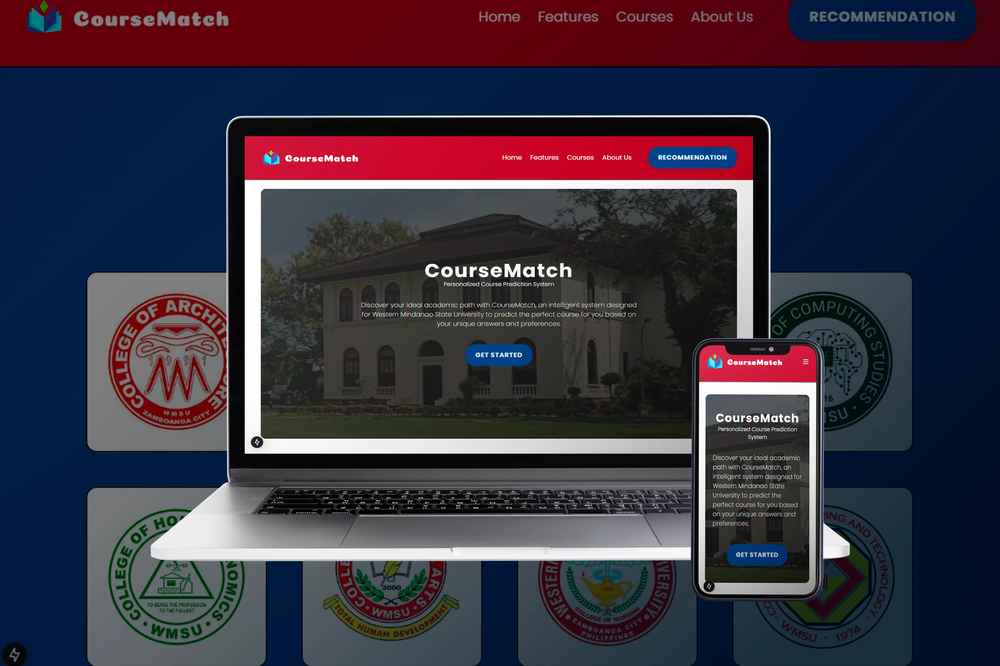
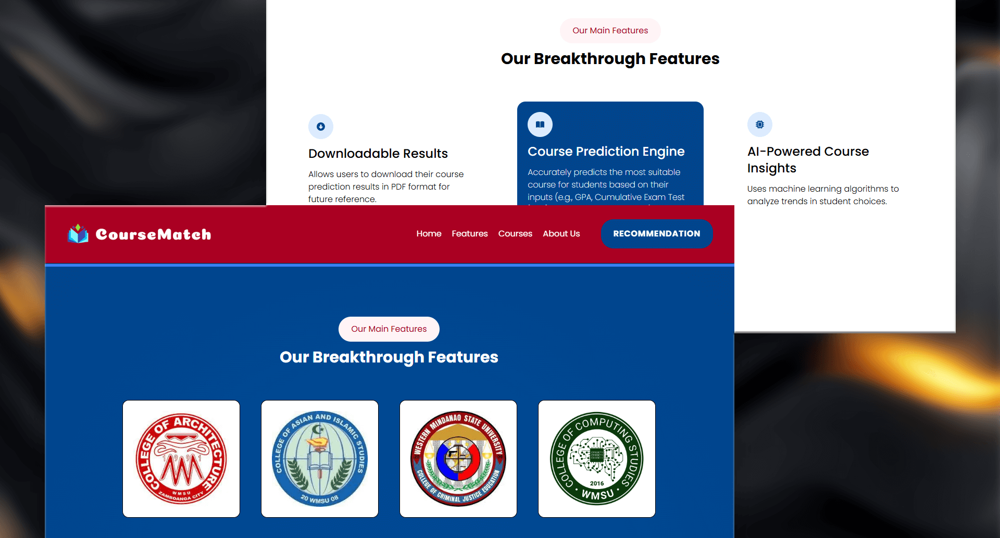
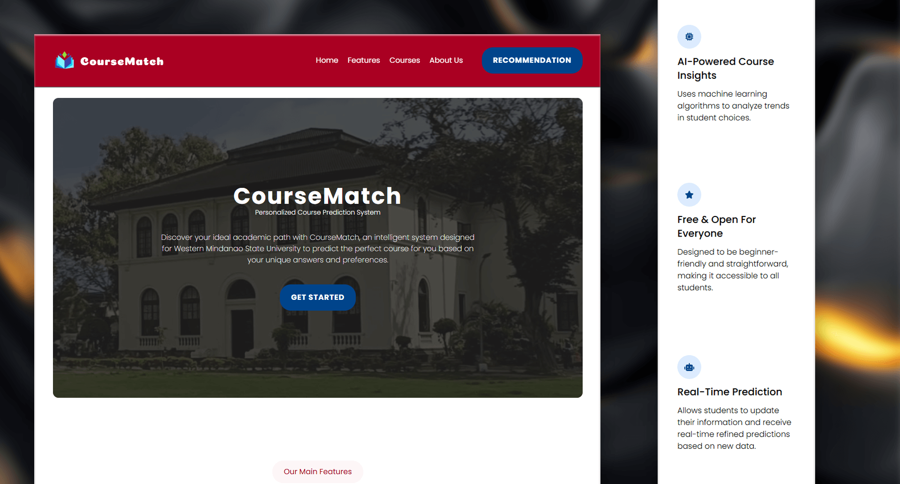
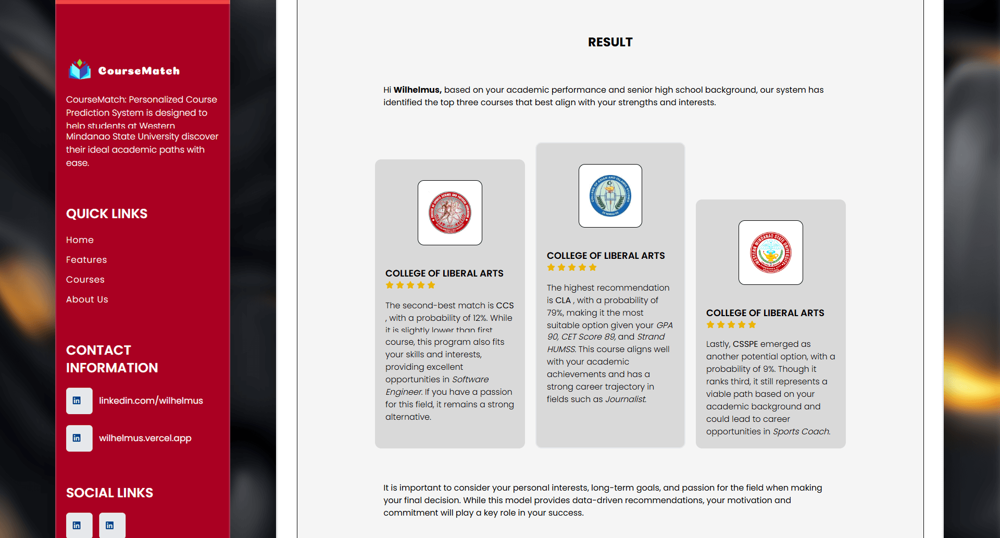
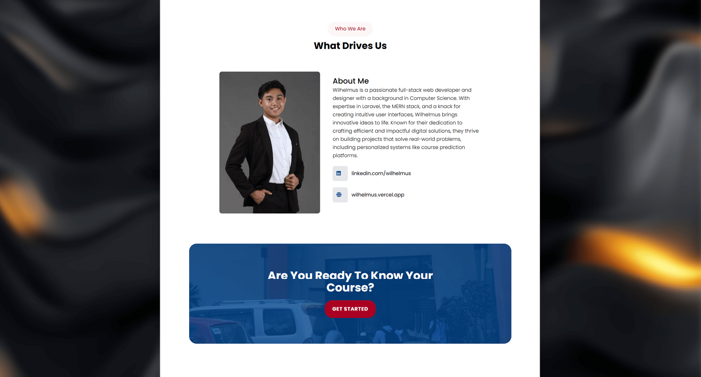

# Eagle Locksmith – Website Revamp

## 📌 Overview

Coursematch is an AI-powered system that predicts suitable courses for students based on inputs such as GPA, CET scores, and strand. It provides detailed insights into potential career paths and academic requirements. The platform is optimized for both desktop and mobile use, ensuring accessibility and ease of use.

As of May 1, 2025, the backend server has been officially shut down. However, you can still view the demo and access the frontend UI.

🔗 **Live Demo:** <a href="https://coursematch.vercel.app/" target="_blank">https://coursematch.vercel.app</a>

---

## ✨ Features

- Responsive layout for mobile and desktop
- Integrated with Next.js framework for optimized performance
- AI-driven course prediction using machine learning
- Downloadable PDF results for easy record-keeping
- User account management for saving and retrieving predictions
- Detailed insights and career path suggestions based on predicted courses

---

## 🛠️ Technologies Used

**Frontend & Design:**

- HTML
- CSS
- JavaScript
- Tailwind CSS
- Next.js

**Technology:**

- jsPDF
- NPM Libraries
- Machine Learning
- TensorFlow
- Python

**Design Tools:**

- Figma
- Adobe Photoshop

---

## 🖼️ Screenshots

|  |  |
| :--------------------------------------------------: | :--------------------------------------------------: |
|  |  |

---

## 📁 Project Type

- 🎨 Design
- 💻 Development

---

## 📂 Tags

- `Machine-Learning`
- `UI/UX-design`
- `Artificial-Intelligence`
- `Responsive-Design`
- `Educational-Technology`

## 🙋‍♂️ About the Developer

Hi! I’m **Wilhelmus**, a Full Stack Web Developer and Web Designer passionate about building impactful digital experiences.

- <a href="https://wilhelmus.vercel.app/?ref=github_course" target="_blank">Portfolio</a>
- <a href="https://www.linkedin.com/in/wilhelmusolejr/" target="_blank">LinkedIn</a>
